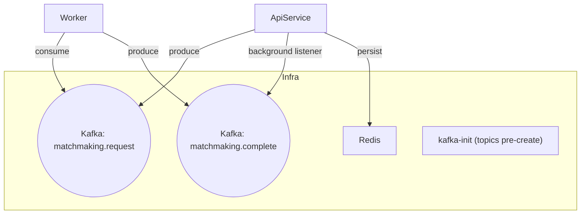

# MatchMaker

**A tiny matchmaking demo built on .NET Aspire.**
Shows how to wire up an HTTP API, a background worker, Kafka, and Redis.

> The Aspire dashboard opens automatically and shows all services, logs, traces, and health checks.

---

## Architecture



* **ApiService** – HTTP API to queue users and fetch matches.
* **Worker** – consumes `matchmaking.request`, groups users in batches (default **3**), publishes `matchmaking.complete`.
* **Kafka** – message broker.
* **kafka-init** – creates Kafka topics before other services start.
* **Redis** – stores finalized matches.

---

## Prerequisites

* .NET Aspire SDK: **9.4.0**
  Install:

  ```bash
  dotnet workload install aspire
  ```
* *(Optional, if you prefer Docker Compose over Aspire):*

  * Docker / Docker Compose
  * Docker yaml was generated by Aspire.Hosting.Docker: **9.4.0-preview\.1.25378.8**

---

## Run with Aspire (recommended)

### Build

```bash
dotnet build
```

### Run

```bash
aspire run
```

* The Aspire dashboard will open automatically.
* **kafka-init** creates the topics **before** the rest of the app starts:

  * `matchmaking.request`
  * `matchmaking.complete`

---

## API

**Base URL** is shown on the **ApiService** page in the Aspire dashboard (see `ASPNETCORE_URLS`).

### POST `/matchmaking/search`

Queue a user for matchmaking.

**Body:**

```json
{ "userId": "111" }
```

**One-liners (bash/PowerShell/CMD):**

```bash
# Replace PORT with the ApiService port from the dashboard
curl -X POST http://localhost:PORT/matchmaking/search \
  -H "Content-Type: application/json" \
  -d "{\"userId\":\"111\"}"

curl -X POST http://localhost:PORT/matchmaking/search \
  -H "Content-Type: application/json" \
  -d "{\"userId\":\"222\"}"

curl -X POST http://localhost:PORT/matchmaking/search \
  -H "Content-Type: application/json" \
  -d "{\"userId\":\"333\"}"
```

> The worker batches users (default **3**). When a batch is ready, it publishes `matchmaking.complete`, and ApiService persists the match to Redis.

---

### GET `/matchmaking/match?userId=111`

Retrieve the **last** match for a user.

```bash
curl "http://localhost:PORT/matchmaking/match?userId=111"
```

**Response (200):**

```json
{
  "matchId": "45ae548e-d72f-438d-bf1a-f1692a699a81",
  "userIds": ["111", "222", "333"]
}
```

**Response (404):**

```json
{ "type": "about:blank", "title": "Not Found", "status": 404 }
```

---

## Kafka Topics

* **`matchmaking.request`** – produced by `ApiService` on `POST /matchmaking/search`.
* **`matchmaking.complete`** – produced by `Worker` when a match is formed; consumed by `ApiService` background listener.
* **`kafka-init`** ensures both topics exist before services start.

---

## Run with Docker (optional)

A `docker-compose.yml` generated with **Aspire.Hosting.Docker 9.4.0-preview\.1.25378.8** is included.

```bash
docker compose up -d --build
# scale workers
docker compose up -d --scale worker=2
```

> ⚠️ If you use Compose, make sure the **ApiService** port is published and update the base URL accordingly. Testing is simplest via `aspire run`.

---

## Troubleshooting

* **App won’t start** → Confirm Aspire SDK **9.4.0** is installed.
* **404 on match** → Push at least **3 distinct** `userId` values to `/matchmaking/search`.
* **Kafka errors** → Check the dashboard to confirm `kafka-init` ran and Kafka is healthy.
* Still stuck? → Use the Aspire dashboard for **logs**, **health**, and **traces** across ApiService, Worker, Redis, and Kafka.

---

## Tech Stack

* .NET 9 + .NET **Aspire 9.4.0**
* **Confluent.Kafka** client
* **StackExchange.Redis**
* Minimal APIs + `BackgroundService` (hosted services)

---

## Roadmap Ideas

* Make batch size configurable via config/ENV.
* Persist match history.
* Metrics & alerts (OpenTelemetry).

---

## License

Specify your project license (e.g., MIT) in `LICENSE`.
